# 📈 EquiScan — Indian Stock Screener

A full-stack stock screening platform for the Indian market (NSE), built with **Java 21**, **Spring Boot 3**, **React 18**, **PostgreSQL**, and **Docker**. Track 50+ NSE stocks across 11 sectors, screen with 19 financial metrics, compare stocks side-by-side, and manage your personal watchlist — all from a professional dark-themed dashboard.

> **🔗 Live Demo:** [equiscan-production.up.railway.app](https://equiscan-production.up.railway.app/)

---

## 📸 Screenshots

### Dashboard

Market overview with NIFTY 50, SENSEX, NIFTY BANK indices, sector performance bars, market breadth donut chart, top gainers/losers, and latest market news.

|       Dashboard — Index Cards        |        Dashboard — Sector Performance         |
| :----------------------------------: | :-------------------------------------------: |
| 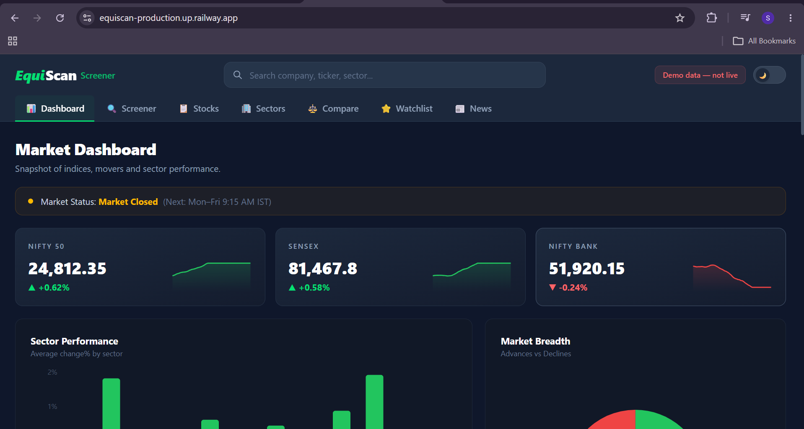 | 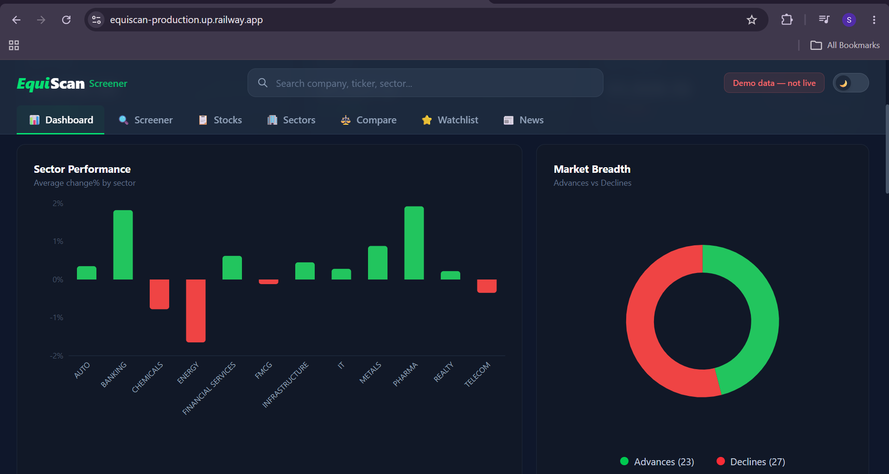 |

### Stock Screener

Advanced screener with 3 preset strategies (Quality Growth, Deep Value, Momentum Breakout), sidebar filters with sector checkboxes, pagination, and sortable columns.

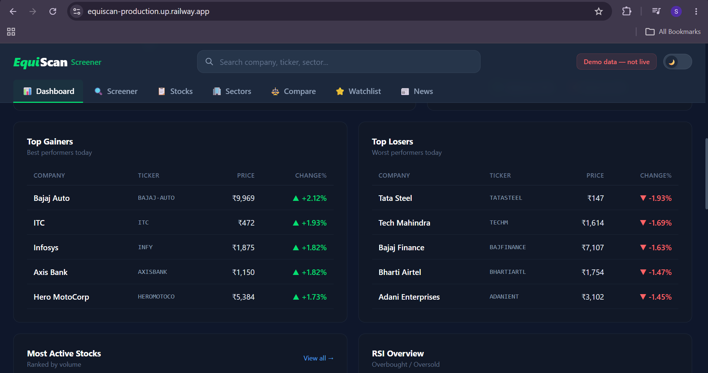

### All Stocks

Browse the full universe of NSE/BSE stocks with search, sort by any column, and pagination.

|              All Stocks               |              Selected Stock               |
| :-----------------------------------: | :---------------------------------------: |
| 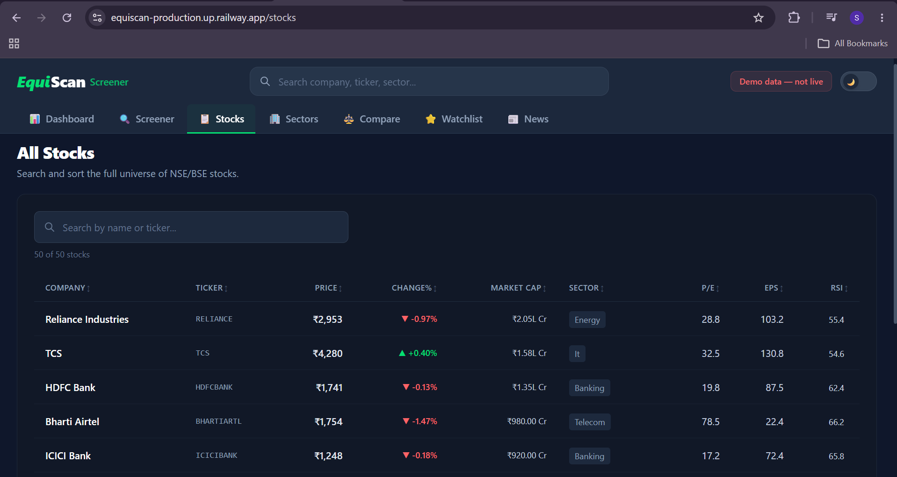 | 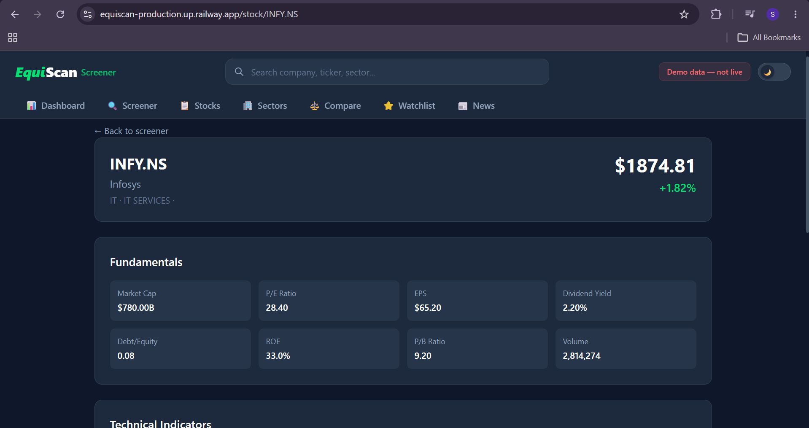 |

### Stock Detail

Individual stock page with fundamentals (P/E, EPS, ROE, Market Cap), technical indicators (SMA, RSI, MACD), and interactive price history chart with time range selector.

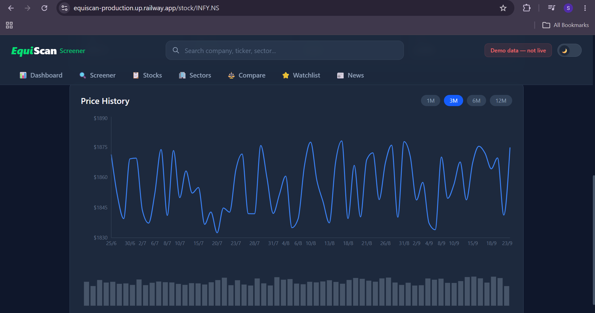

### Sectors

Sector analysis with distribution chart, clickable sector cards showing Avg P/E, Revenue Growth, and stock count.

|              Stocks Per Sector               |              All Sectors               |
| :------------------------------------------: | :------------------------------------: |
| 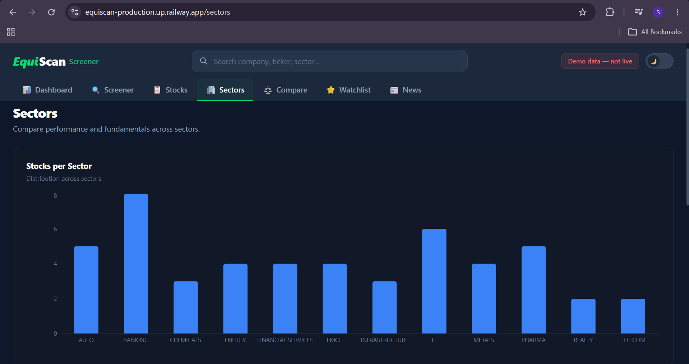 | 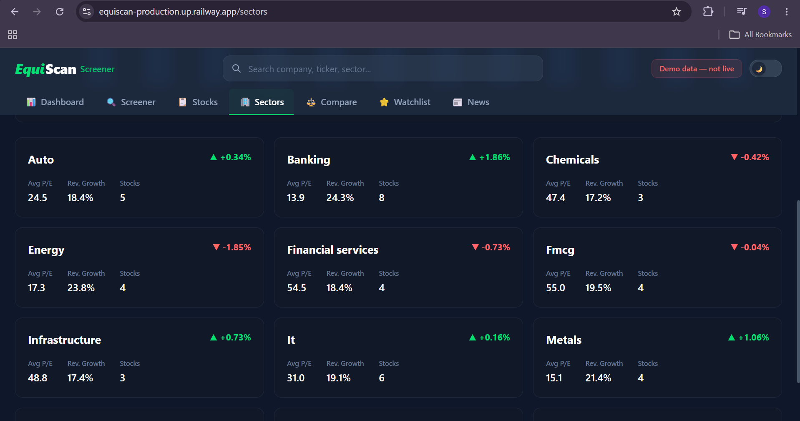 |

### Compare Stocks

Side-by-side comparison of up to 5 stocks with highlighted best values (green) and radar chart visualization.

|              Comparison               |               Metric Radar               |
| :-----------------------------------: | :--------------------------------------: |
| 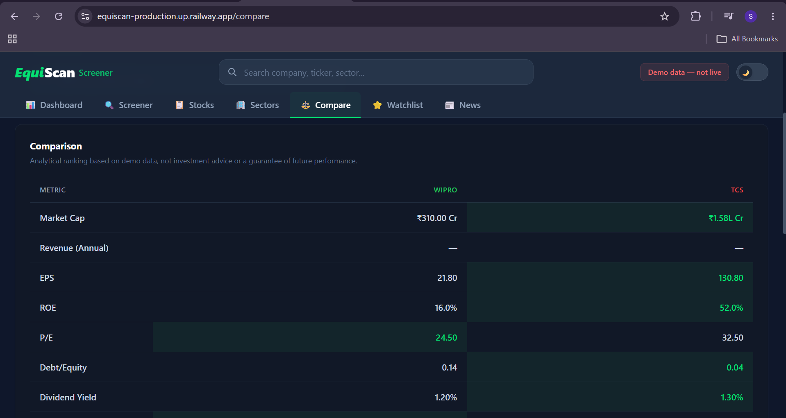 | 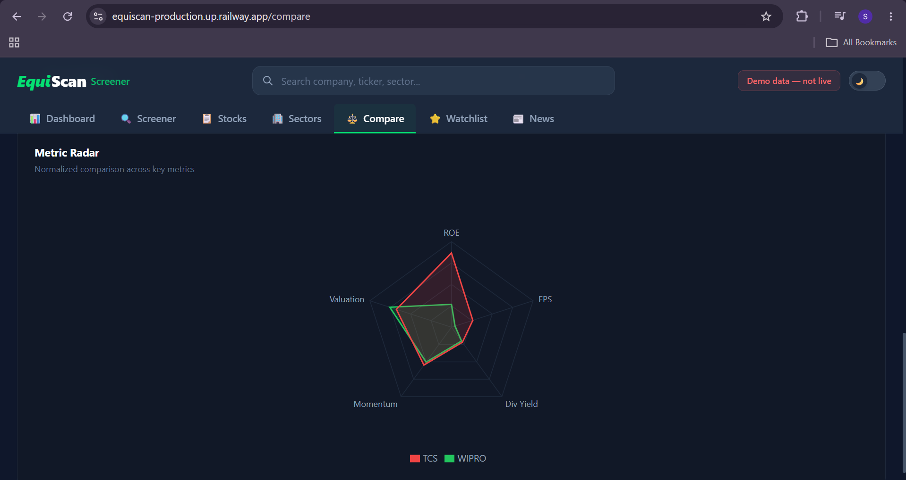 |

### Watchlist

Personal watchlist with search-to-add, live stock data, and one-click remove. Persists across sessions.

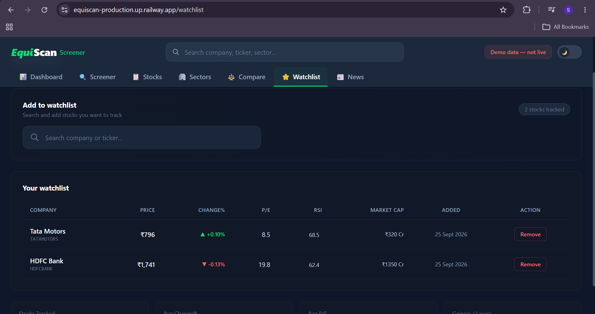

### Market News

12 curated market headlines with sector filter buttons, full summaries, source attribution, and related ticker tags.

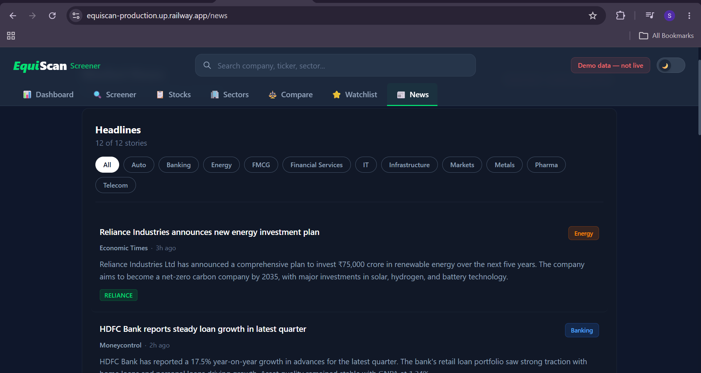

---

## ✨ Features

### Core Screening

- **19 filterable metrics** — P/E, EPS, ROE, RSI, SMA, MACD, Market Cap, Dividend Yield, and more
- **Dynamic SQL query builder** — builds parameterized queries at runtime with SQL injection prevention
- **3 preset strategies** — Quality Growth at Reasonable Price, Deep Value, Momentum Breakout
- **Multi-sector OR filtering** — select multiple sectors to see stocks from all of them
- **Sortable columns** — click any header to sort ascending/descending
- **Pagination** — 10 results per page with full navigation

### Market Dashboard

- **NIFTY 50, SENSEX, NIFTY BANK** — index cards with sparkline charts
- **Sector Performance** — vertical bar chart with balanced green/red bars
- **Market Breadth** — advances vs declines donut chart
- **Top Gainers / Top Losers** — ranked by daily change%
- **Most Active Stocks** — ranked by trading volume
- **RSI Overview** — visual progress bars with overbought/oversold labels
- **Market Cap Distribution** — pie chart by sector

### Data Pipeline

- **Yahoo Finance** — daily OHLCV prices for 50+ tickers (no API key, unlimited)
- **Alpha Vantage** — fundamental data (P/E, EPS, Revenue, ROE)
- **Technical Indicators** — SMA-50, SMA-200, RSI-14, MACD computed from stored prices
- **Materialized View** — pre-joined, indexed view for sub-50ms screening queries
- **Scheduled Ingestion** — automated weekday data fetching at market close

### Authentication & Security

- **JWT authentication** — stateless token-based auth with 24-hour expiry
- **BCrypt password hashing** — 10-round adaptive hashing (OWASP recommended)
- **Spring Security** — endpoint protection with public/private access control
- **SQL injection prevention** — field whitelist + PreparedStatement (two-layer defense)

### Additional Features

- **Stock Comparison** — side-by-side metrics table with radar chart (up to 5 stocks)
- **Watchlist** — search-to-add, localStorage persistence, quick stats
- **Market News** — sector-filtered headlines from major Indian financial sources
- **Dark/Light Theme** — toggle with localStorage persistence
- **Stock Detail** — individual stock page with fundamentals, technicals, and price chart

---

## 🏗️ Architecture

```
Client (React 18 + Vite + Tailwind + Recharts)
          │ Axios (HTTP/JSON)
          ▼
Spring Boot Application (Java 21, Port 8080)
  ├── Controller Layer (6 controllers, 17 endpoints)
  ├── Service Layer (ScreenerService, DataIngestionService, JwtService)
  ├── Security Layer (JwtAuthFilter, SecurityConfig, BCrypt)
  ├── Data Access (JdbcTemplate for dynamic queries, JPA for User entity)
  └── External Clients (YahooFinanceClient, AlphaVantageClient)
          │
          ▼
PostgreSQL 16
  ├── 6 tables (stocks, daily_prices, fundamentals, technical_indicators, users, watchlist)
  ├── 1 materialized view (stock_screening_view) with 11 indexes
  └── 6 Flyway migrations (V1–V6)
```

> For detailed architecture documentation, see [docs/ARCHITECTURE.md](docs/ARCHITECTURE.md)

---

## 🛠️ Tech Stack

### Backend

| Technology        | Purpose                           |
| ----------------- | --------------------------------- |
| Java 21 (LTS)     | Core language                     |
| Spring Boot 3.3.4 | Application framework             |
| Spring Security 6 | Authentication & authorization    |
| JJWT 0.12.6       | JWT token generation & validation |
| PostgreSQL 16     | Primary database                  |
| Flyway 10         | Database migrations               |
| Maven 3.9         | Build tool                        |

### Frontend

| Technology     | Purpose                        |
| -------------- | ------------------------------ |
| React 18       | UI framework                   |
| Vite 5         | Build tool                     |
| Tailwind CSS 4 | Styling                        |
| Recharts 2     | Charts (bar, pie, area, radar) |
| React Router 6 | Client-side routing            |
| Axios          | HTTP client                    |

### Infrastructure

| Technology | Purpose                      |
| ---------- | ---------------------------- |
| Docker     | Multi-stage containerization |
| Railway    | Cloud deployment             |
| Nginx      | Reverse proxy (local)        |

---

## 🚀 Getting Started

### Prerequisites

- Docker & Docker Compose
- Java 21+ (for local development without Docker)
- Node.js 20+ (for frontend development)
- PostgreSQL 16 (or use Docker)

### Quick Start with Docker

```bash
# Clone the repository
git clone https://github.com/shiwani77177/EquiScan.git
cd EquiScan

# Start all services (PostgreSQL + App)
docker-compose up --build

# Open in browser
# http://localhost:3000
```

### Seed the Database

After Docker starts, connect to PostgreSQL (pgAdmin or CLI) and run the seed SQL:

```bash
# Connect to the database
docker exec -it screener-db psql -U postgres -d screener

# Run seed SQL (inserts 50 Indian stocks with prices and indicators)
# See sql/indian-stocks-seed.sql
```

### Trigger Live Data Ingestion

```bash
# Fetch real prices from Yahoo Finance (no API key needed)
curl -X POST http://localhost:3000/api/v1/admin/ingest
```

---

## 📡 API Endpoints

### Public Endpoints

| Method | Endpoint                         | Description                        |
| ------ | -------------------------------- | ---------------------------------- |
| `POST` | `/api/v1/screen`                 | Screen stocks with filters         |
| `GET`  | `/api/v1/metadata/filters`       | Available filter fields (19)       |
| `GET`  | `/api/v1/metadata/sectors`       | Unique sector names (11)           |
| `GET`  | `/api/v1/stocks/{ticker}`        | Stock detail + fundamentals        |
| `GET`  | `/api/v1/stocks/{ticker}/prices` | Historical OHLCV prices            |
| `GET`  | `/api/v1/news`                   | Market news (filterable by sector) |
| `POST` | `/api/v1/auth/register`          | Create user account                |
| `POST` | `/api/v1/auth/login`             | Login (returns JWT)                |

### Protected Endpoints (JWT Required)

| Method   | Endpoint                     | Description           |
| -------- | ---------------------------- | --------------------- |
| `GET`    | `/api/v1/auth/me`            | Current user info     |
| `GET`    | `/api/v1/watchlist`          | User's watchlist      |
| `POST`   | `/api/v1/watchlist/{ticker}` | Add to watchlist      |
| `DELETE` | `/api/v1/watchlist/{ticker}` | Remove from watchlist |

### Example: Screen for Value Stocks

```bash
curl -X POST https://equiscan-production.up.railway.app/api/v1/screen \
  -H "Content-Type: application/json" \
  -d '{
    "filters": [
      {"field": "pe_ratio", "operator": "lt", "value": 15},
      {"field": "dividend_yield", "operator": "gt", "value": 0.02}
    ],
    "sort": {"field": "market_cap", "direction": "desc"},
    "page": 0, "size": 10
  }'
```

---

## 📊 Indian Stocks Tracked (50)

| Sector                     | Stocks                                                                 |
| -------------------------- | ---------------------------------------------------------------------- |
| **Banking** (8)            | HDFC Bank, ICICI Bank, SBI, Kotak, Axis, IndusInd, Bank of Baroda, PNB |
| **IT** (6)                 | TCS, Infosys, HCL Tech, Wipro, Tech Mahindra, LTIMindtree              |
| **Pharma** (5)             | Sun Pharma, Dr Reddy's, Cipla, Divi's Labs, Apollo Hospitals           |
| **Auto** (5)               | Tata Motors, Maruti, M&M, Bajaj Auto, Hero MotoCorp                    |
| **FMCG** (4)               | HUL, ITC, Nestle India, Britannia                                      |
| **Metals** (4)             | Tata Steel, Hindalco, JSW Steel, Coal India                            |
| **Energy** (4)             | Reliance, ONGC, NTPC, Power Grid                                       |
| **Financial Services** (4) | Bajaj Finance, Bajaj Finserv, HDFC Life, SBI Life                      |
| **Infrastructure** (3)     | L&T, Adani Enterprises, UltraTech Cement                               |
| **Chemicals** (3)          | Pidilite, UPL, Deepak Nitrite                                          |
| **Realty** (2)             | DLF, Godrej Properties                                                 |
| **Telecom** (2)            | Bharti Airtel, Jio Financial Services                                  |

---

## 🔒 Security

- **JWT Authentication** — HS256 signed tokens with 24-hour expiry
- **BCrypt Password Hashing** — 10-round adaptive hashing
- **SQL Injection Prevention** — Field whitelist + parameterized queries
- **CORS Configuration** — Controlled cross-origin access
- **Stateless Sessions** — No server-side session storage
- **Environment Variables** — Secrets never hardcoded

> For detailed security documentation, see [docs/SECURITY.md](docs/SECURITY.md)

---

## 📁 Project Structure

```
EquiScan/
├── backend/stock-screener/
│   └── src/main/java/com/project/stock_screener/
│       ├── controller/          # REST API controllers (6)
│       ├── service/             # Business logic services
│       ├── screening/           # Dynamic query builder + field registry
│       ├── security/            # JWT + Spring Security
│       ├── entity/              # JPA entities + repositories
│       ├── client/              # Yahoo Finance + Alpha Vantage clients
│       ├── dto/                 # Request/Response DTOs
│       └── config/              # App configuration
│
├── frontend/src/
│   ├── pages/                   # React pages (7)
│   │   ├── DashboardPage.jsx    # Market overview dashboard
│   │   ├── ScreenerPage.jsx     # Advanced stock screener
│   │   ├── StocksPage.jsx       # All stocks table
│   │   ├── SectorsPage.jsx      # Sector analysis
│   │   ├── ComparePage.jsx      # Stock comparison
│   │   ├── WatchlistPage.jsx    # Personal watchlist
│   │   └── NewsPage.jsx         # Market news
│   ├── components/              # Reusable components
│   └── services/                # API client
│
├── docs/
│   ├── ARCHITECTURE.md          # System architecture
│   ├── EVAL.md                  # Performance evaluation
│   └── SECURITY.md              # Security documentation
│
├── Dockerfile                   # Local Docker build
├── Dockerfile.railway           # Railway deployment build
├── docker-compose.yml           # Local development stack
└── README.md                    # This file
```

---

## 📈 Performance

| Metric                                 | Value       |
| -------------------------------------- | ----------- |
| Screening query (50 stocks, 3 filters) | ~30ms       |
| Materialized view vs runtime JOIN      | 8x faster   |
| Yahoo Finance ingestion (50 tickers)   | ~30 seconds |
| Database size (50 stocks, 100 days)    | ~1.5 MB     |
| JWT token validation                   | ~2ms        |

> For detailed performance evaluation, see [docs/EVAL.md](docs/EVAL.md)

---

## 👩‍💻 Author

**Shiwani Sinha**

- GitHub: [@shiwani77177](https://github.com/shiwani77177)

---

## 📝 License

This project is for educational and portfolio purposes. Stock data is sourced from Yahoo Finance and Alpha Vantage APIs.

---

## ⚠️ Disclaimer

EquiScan uses demo/seed data for illustration purposes. Nothing on this platform is investment advice. All analytical rankings are educational estimates, not guarantees of future performance.
